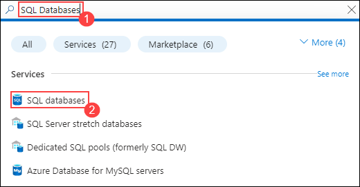
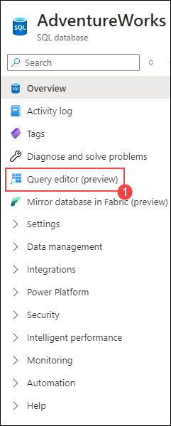
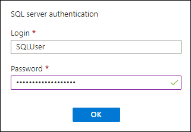
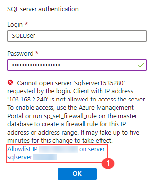
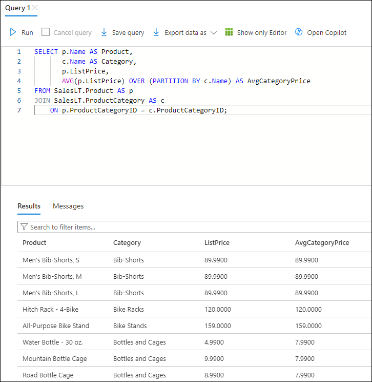

# Lab 08: Use window functions
### Estimated Duration: 30 minutes
In this Lab, you'll apply window functions on the **Adventureworks** database.

### Lab objectives
In this lab, you will complete the following tasks:
- Task 1: Ranking function
- Task 2: Aggregation function by partition

## Task 1: Ranking function

Let's start by creating a query that uses a window function to return a ranking value.

1. In the Azure portal, Search for **SQL Databases(1)**, and click on **SQL Databases(2)**.

    
1. On the page for your **Adventureworks** SQL Database, in the pane on the left, select **Query editor(preview)**(1).

    

1. On the welcome page, sign into your database using SQL server authentication using the following credentials: 
    - Login : SQLUser
    - Password : MyAdminPassword123! 

1. Click on OK.

    

1. Click on Allowlist IP XXX.XXX.XXX.XXX on server sqlserver<inject key="DeploymentID" enableCopy="false" /></inject> and then click on OK again.

    
1. In the query editor, enter the following code:

    ```sql
    SELECT C.Name AS 'Category',
            SUM(D.OrderQty) AS 'ItemsSold',
            RANK() OVER(ORDER BY SUM(D.OrderQty) DESC) AS 'Rank'
    FROM SalesLT.SalesOrderDetail AS D
    INNER JOIN SalesLT.Product AS P
        ON D.ProductID = P.ProductID
    INNER JOIN SalesLT.ProductCategory AS C
        ON P.ProductCategoryID = C.ProductCategoryID
    GROUP BY C.Name
    ORDER BY Rank;
    ```

1. Run the query and review the results. The product categories in the results have a rank number according to the number of items sold within each category. The rank is based on a descending order of sales (so the category with most items sold is 1, the category with the second most items sold is 2, and so on).

    

    > **Tip**: Look closely at the results to see how rank is assigned to categories with the same number of sales.

## Task 2: Aggregation function by partition

Now, let's create a query that returns each product with its category and list price along with the average list price for products in the same category.

1. In the query editor, replace the existing query with the following code:

    ```sql
    SELECT p.Name AS Product,
           c.Name AS Category,
           p.ListPrice,
           AVG(p.ListPrice) OVER (PARTITION BY c.Name) AS AvgCategoryPrice
    FROM SalesLT.Product AS p
    JOIN SalesLT.ProductCategory AS c
        ON p.ProductCategoryID = c.ProductCategoryID;
    ```

1. Run the query and review the results. The OVER clause applies the average function to ListPrice, partitioning by category (in other words, it calculates the average list price for products in each category; so you can easily compare the price of an individual product to the average price of all products in the same category).

    
## Challenges

Now it's your turn to use window functions.

> **Tip**: Try to determine the appropriate code for yourself. If you get stuck, suggested answers are provided at the end of this lab.

### Challenge 1: Rank salespeople based on orders

Write a query that ranks the salespeople based on the number of orders placed by the customers they are assigned to.

### Challenge 2: Retrieve each customer with the total number of customers in the same region

Write a query that returns the company name of each customer, the city in which the customer has its main office, and the total number of customers with a main office in the same region.

## Challenge Solutions

This section contains suggested solutions for the challenge queries.

### Challenge 1

```sql
SELECT c.SalesPerson,
        COUNT(o.SalesOrderID) AS 'SalesOrders',
        RANK() OVER(ORDER BY COUNT(o.SalesOrderID) DESC) AS 'Rank'
FROM SalesLT.SalesOrderHeader AS o
INNER JOIN SalesLT.Customer AS c
    ON o.CustomerID = c.CustomerID
GROUP BY c.SalesPerson
ORDER BY Rank;
```

### Challenge 2

```sql
SELECT c.CompanyName,
       a.CountryRegion,
       COUNT(c.CustomerID) OVER (PARTITION BY a.CountryRegion) AS CustomersInRegion
FROM SalesLT.Customer AS c
JOIN SalesLT.CustomerAddress AS ca
    ON c.CustomerID = ca.CustomerID
JOIN SalesLT.Address AS a
    ON ca.AddressID = a.AddressID
WHERE ca.AddressType = 'Main Office';
```
## You have successfully completed the lab.